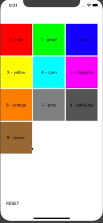
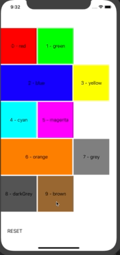
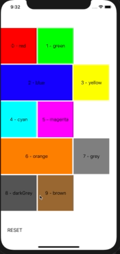

# uicollectionview-reorder-error
iOS Objective-C example for reorder UICollectionView's cells with dynamic size and custom layout that results in error

## The Problem

  As an user, I need to reorder the UICollectionView's cells with dynamic size and custom layout


## Working GIFs

The GIF below is this project with ```#define USE_DYNAMIC_SIZE 0```.

This is the effect I want, but instead using fixed-size cells, I want to use dynamic sized cells.



As expected, I can reorder the last cell (9 - brown) with any cells. The animation is provided by UICollectionView itself when using the Drop Intent ```UICollectionViewDropIntentInsertAtDestinationIndexPath```.


## The Errors

### Error 1

The first error is that, when dragging a small cell to be before a large one, the large cell goes to side with smaller size, the blank/void space is the old-larger cell size.
This probably is created by the custom UICollectionViewLayout's prepareLayout() method.
The drop operation is working, the dragging animation not.




### Error 2

Another example dragging the last cell (9 - brown) to the larger cell and dropping it.
The drop operation worked, the dragging animation not.




### Error 3

As Error 1 and 2, the last cell (9 - brown) is dragged to the first larger cell and dropped.
The best case here would be the (9 - brown) cell be dropped AFTER the (2 - blue) cell, not before.


### Error 4

If I drag a larger cell before a small cell, the small cell is going to take all the old larger cell spacement.
This is the same layout issue, but with a larger cell being dragged.


## Enable/disable code features

In the file ```TestCollectionViewLayout.m``` you can enable and disable the dynamic cell size with the ```#define USE_DYNAMIC_SIZE``` . Just set it to 0 or 1.

In the file ```NSLogDebug.h```you can enable and disable the NSLog debugs I made with the ```#define DEBUG_TO_TERMINAL``` . Just set it to 0 or 1.
